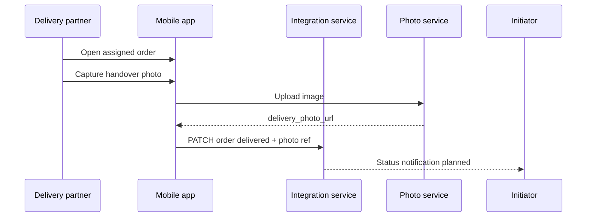

# SharingBridge — Future extensions (order operations)

**Purpose:** Technical supplement for **order operations** — payer marks payment done (Phase A), delivery proof (Phase B), recurring orders (Phase C), and recipe-BOM ingredient demand for producers (Phase D summary — vocabulary lives in PRODUCT_MODEL). **Not** the full marketplace roadmap.

**Read first:** [README.md](../README.md) · shipped baseline: [STATUS.md](../development/STATUS.md).

| Topic | Authoritative doc |
|-------|-------------------|
| Glossary, actors, marketplace, dashboard UX | [PRODUCT_MODEL.md](../development/PRODUCT_MODEL.md) |
| Configurator, payer, unified initiation | [Configurator_Role_and_Unified_Initiation.md](./Configurator_Role_and_Unified_Initiation.md) |
| Engineering phases E–K | [ENGINEERING_PLAN.md](../development/ENGINEERING_PLAN.md) § Marketplace phases |
| Producer supply, recipe BOM, UOM | [PRODUCT_MODEL.md](../development/PRODUCT_MODEL.md) § Producer supply & recipe BOM |
| SQL run order | [database-setup-sequence.md](../configuration/database-setup-sequence.md) |
| Stack today | [Technical Architecture § As-built](./SharingBridge_Technical_Architecture.md#as-built-architecture-july-2026) |

---

## What exists today (baseline)

Do not duplicate the full shipped table here — see **[STATUS.md](../development/STATUS.md)**.

Order-ops relevant facts for this file:

| Capability | Status |
|------------|--------|
| Order intents + neighbourhood geo feed | Shipped |
| Mark payment done (web) | Shipped |
| Map tab (web) | Shipped |
| Delivery photo **capture** / delivery-partner UX | **Open** (Phase B) |
| Recurring orders / recipe BOM | **Future** (Phases C–D) |

Payments stay in vendor apps. SharingBridge tracks intent and status.

---

## Design principles (all phases)

1. **Facilitator, not merchant of record** — **Payers** pay **vendors or delivery partners directly** (vendors are the **payees** of those funds); the platform orchestrates visibility, assignment, and status—not a pooled escrow account unless a future legal scope says otherwise (see BRD *Operating Constraints*).
2. **Server-side authorization** — Initiators on the limited dashboard see only their rows; coordinators see operational fields; **admins** see PII (e.g. email) when needed. APIs on Render; Postgres on Supabase with **no client DB keys** ([authentication.md](../configuration/authentication.md)).
3. **Single persistence** — Postgres only after cutover; no parallel JSON file reads in production ([database.md](../configuration/database.md)).
4. **Explicit status enums** — Human-readable states initiators, payers, and coordinators can understand and audit.

---

## Phase A — Order operations (near-term)

**Goal:** Turn **order initiation** into a trackable **order** for coordinators and initiators/payers, without vendor API integration.

### A.1 Payer marks payment done — **shipped (web)**

After the **payer** places and pays in the **vendor app**, they open **order history** (mobile; web limited dashboard), select the record, and set:

| Field | Example values |
|-------|------------------|
| `payment_status` | `pending` → `paid_externally` (initiator/payer action) |

- **Who can update:** Initiator/payer (own record only); coordinator/admin may correct in disputes (audit log later).
- **UX:** Single action — “Mark payment done” on the selected row; optional confirmation dialog.
- **No** automatic payment verification in this phase (no Swiggy/Zomato webhooks).

### A.2 Coordinator / initiator dashboards (next slice)

**Goal:** Initiators see **neighbourhood activity** (default window from `DONOR_NEIGHBOURHOOD_WINDOW_HOURS`) on mobile and web; coordinators retain full ops view. **Dashboard list columns** (planned — [PRODUCT_MODEL.md](../development/PRODUCT_MODEL.md)): **Order intent taken** (`created_at`), **Delivered at** (`delivered_at`, often empty), **Distance (m)** (`distance_m`); list sorted by **`distance_m` ascending** when viewer sends `near_lat` / `near_lng`; elapsed freshness from **`created_at`** only.

| Viewer | List | PII / photos |
|--------|------|----------------|
| **Initiator** (mobile + web limited) | Own intents + **neighbourhood** feed (`since`, `near_lat`/`near_lng`); web groups **By day** / **By area** (area includes **No location on record**) | **No email**; opaque `user_id`; **reference thumbnails in neighbourhood feed** within the server time window |
| **Coordinator** | All intents; filter by day, `user_id`, optional `since`, `near_lat/lng`, `locality_key` (PostGIS; map UI later) | Full ops fields; **initiator email**; photos per policy |
| **Admin** | Same as coordinator + user lookup | May include email for support |

Initiator limited web dashboard ([environment-variables.md](../configuration/environment-variables.md) § Web dashboard roles). **`since=Nh`** and **`near_lat` / `near_lng`** apply radius **`DONOR_NEIGHBOURHOOD_RADIUS_M`** (metres) server-side; API returns **`distance_m`** per row and **`feed.radius_m`**. Without viewer location, initiators see only their own rows in the time window. Location is stored on `POST` when `location_lat` / `location_lng` are sent (mobile **Help a seeker** captures GPS on copy/register). Named locality labels (`chennai-adyar`) remain future work.

**Neighbourhood API:**

- `GET /v1/donor-seeker/order-intents?since=2h&near_lat=…&near_lng=…` — server applies radius; response rows include `distance_m`, `created_at`, `delivered_at` (when column exists).
- `GET /v1/donor-seeker/order-intents?locality_key=…&since=2h`

### A.3 Data fields (additive)

Extend stored order / order_intent records:

- `payment_status`, `delivery_status`
- `location_lat`, `location_lng`, `location_label`, `locality_key` (optional at registration; PostGIS `location` **shipped**)
- `delivered_at` (nullable; dashboard column before Phase B routinely fills it — [schema-delivered-at-migration.sql](../configuration/schema-delivered-at-migration.sql))
- `updated_at` for filters; list sort by **`distance_m`** when neighbourhood coords present (not `updated_at` for initiator neighbourhood view)

JWT: keep active `role` per session; add `roles[]` and optional **`admin`** in `user_roles` ([database.md](../configuration/database.md)).

### A.4 API sketch (illustrative)

- `PATCH /v1/order-intents/:id` — initiator/payer updates `payment_status` on own row.
- `GET /v1/order-intents?since=2h&locality_key=…` — neighbourhood + coordinator filters (§ A.2).
- Integration-service: strip **email** from initiator-role responses; omit or redact `reference_photo_*` URLs when intent age > 2h for initiator JWT.
- Response grouping by day + `user_id` / locality: client-side today; server-side optional.

**Feasibility:** High. Builds on existing routes and auth; needs Postgres + UI work.

### A.5 Coordinator map UI (PostGIS list queries shipped)

**Shipped:** `order_intents.location` + `listForDashboard` SQL (`ST_DWithin`, `locality_key`). Run [schema-postgis-migration.sql](../configuration/schema-postgis-migration.sql) on older DBs; `npm run db:backfill-order-intent-geo` in integration-service.

**Shipped:** Coordinator web **Map** tab (pins for intents + seeker demands; `VITE_GOOGLE_MAPS_API_KEY`). **Next:** bbox pan / viewport queries (`ST_MakeEnvelope`), clustering.

---

## Phase B — Delivery proof (next after A)

**Goal:** Close the loop in BRD steps 10–11 with evidence, without claiming legal certification.

### B.1 Delivery partner captures proof

1. Authorized **delivery partner** (new role or vendor-scoped account) opens an assigned order.
2. Takes a **photo at handover** to the seeker (in-app camera).
3. Upload goes to **photo-service** (or integration-stored object URL); linked on the same order record.
4. Sets `delivery_status` → `delivered` (or `completed`).

| Field | Notes |
|-------|--------|
| `delivery_photo_url` | Time-limited or access-controlled URL |
| `delivered_at` | Timestamp (nullable on intent row until partner marks delivery; shown on dashboard even when empty) |
| `delivery_status` | `out_for_delivery` → `delivered` |

### B.2 Initiator / payer visibility

Initiator/payer sees status progression and optionally a thumbnail of delivery proof (policy: blur faces if required by safety module later).

**Feasibility:** Medium. Depends on `sharingbridge-photo-service`, delivery-role auth, and mobile capture UX. Aligns with [Technical Architecture](./SharingBridge_Technical_Architecture.md) delivery verification themes.

---

## Phase C — Recurring orders (subscriptions)

**Goal:** Let an initiator/payer book **repeat orders for a period** (e.g. lunch every weekday for a month for a parent) instead of registering each intent by hand. Recurring plans are also the main input to demand aggregation (Phase D).

### C.1 Plan model (additive)

New table `recurring_orders` (occurrences reuse `order_intents` — no parallel order pipeline):

| Field | Notes |
|-------|-------|
| `initiator_user_id` | Signed-in demand initiator (beneficiary has no login) |
| `beneficiary_ref` | Same beneficiary context as one-off intents (address, notes, consent) |
| `standard_item_id` + `portions` | Standard menu item and quantity per occurrence |
| `cadence` | Simple recurrence: `daily` \| `weekdays` \| `weekly` + day list (no full RRULE in v1) |
| `starts_on` / `ends_on` | Bounded period; renewal is an explicit action |
| `status` | `active` → `paused` → `ended` (payer-controlled) |

A scheduler (integration-service job) materializes the next occurrence into `order_intents` per window, tagged with `recurring_order_id`, so existing dashboards, connection, and delivery flows work unchanged.

### C.2 Dashboards

| Viewer | Sees |
|--------|------|
| **Initiator / payer** | Plan card: cadence, next occurrence, fulfilled vs upcoming count, pause/end |
| **Coordinator** | Aggregated recurring demand per window / `locality_key` alongside one-off intents |
| **Eco kitchen / fulfiller** | Committed portions per window including recurring volume (predictable base load) |

### C.3 API sketch (illustrative)

- `POST /v1/recurring-orders` — create plan (initiator JWT).
- `GET /v1/recurring-orders?mine=1` — plans + next occurrence.
- `PATCH /v1/recurring-orders/:id` — pause / resume / end.
- Occurrence rows appear in existing `GET /v1/donor-seeker/order-intents` responses with `recurring_order_id`.

**Payment stays off-platform** per BRD — a recurring plan is a demand commitment, not a stored payment method.

**Feasibility:** High for the plan CRUD + materializer; the main new piece is the scheduled job.

---

## Phase D — Recipe BOM & producer supply (summary)

**Differentiator:** an **economical avenue** connecting **organic producers** to buyers. Producers **never see a raw buyer list** — the platform converts aggregated meal demand into **ingredient demand** via recipe explosion, enabling production at scale and **JIT supply**.

Pipeline: recurring plans (Phase C) + one-off intents per window/locality → **standard items** → **recipe (BOM)** explosion → ingredient quantities (**UOM**) → producer commitments.

- **Recipes are authored by chefs/mentors** who introduce standard items: versioned ingredient lists with quantity-per-portion and UOM (kg, L, count).
- Producers see only **ingredient × quantity × window × locality**, and commit supply against it.

**Authoritative spec:** vocabulary and model in [PRODUCT_MODEL.md](../development/PRODUCT_MODEL.md) § Producer supply & recipe BOM; engineering phases **J–K** in [ENGINEERING_PLAN.md](../development/ENGINEERING_PLAN.md) § Marketplace phases. Do not extend BOM details here.

---

## Marketplace (moved — do not extend this file)

Eco kitchen pledging, kitchen commitments, allocation, and configurator model:

- [Eco_Kitchen_Initiation_Flow.md](./Eco_Kitchen_Initiation_Flow.md) — **authoritative** initiation routes and connection
- [PRODUCT_MODEL.md](../development/PRODUCT_MODEL.md) — glossary, actors, **producer supply & recipe BOM**
- [Configurator_Role_and_Unified_Initiation.md](./Configurator_Role_and_Unified_Initiation.md) — configurator vs automation
- [ENGINEERING_PLAN.md](../development/ENGINEERING_PLAN.md) — marketplace phases **E–K**
- [database-setup-sequence.md](../configuration/database-setup-sequence.md) — SQL for marketplace tables

---

## Summary table (order operations only)

| Phase | Payer / initiator | Ops viewer | Vendor (payee of funds) | Delivery |
|-------|---------------|------------|--------|----------|
| **Today** | Register initiation, own list | Web list (coordinator role) | External app only | External |
| **A** | Mark payment done on record | Filters, neighbourhood columns | — | Status fields only |
| **B** | See delivery proof | Monitor | — | Photo + complete |
| **C** | Book / pause recurring plan | Aggregated recurring demand per window | Predictable base load per window | Reuses A–B per occurrence |
| **D** | — (demand input only) | Ingredient demand per window/locality | Producers commit supply (no buyer list) | — |
| **Marketplace** | See PRODUCT_MODEL | Configurator (setup only) | Self-service bids | See ENGINEERING_PLAN E–K |

---

## Document maintenance

When Phase A ships, update:

- [SharingBridge_End_to_End_Workflow.md](./SharingBridge_End_to_End_Workflow.md) status table (steps 8–11).
- [database.md](../configuration/database.md) schema section.
- [MANUAL_TESTING_GUIDE.md](../testing/MANUAL_TESTING_GUIDE.md) new flows.
- [AGENT_SESSION.md](../development/AGENT_SESSION.md) “Next Recommended Tasks”.

**Last updated:** 2026-07 — added Phase C (recurring orders) and Phase D summary (recipe BOM / producer supply; spec in PRODUCT_MODEL).
